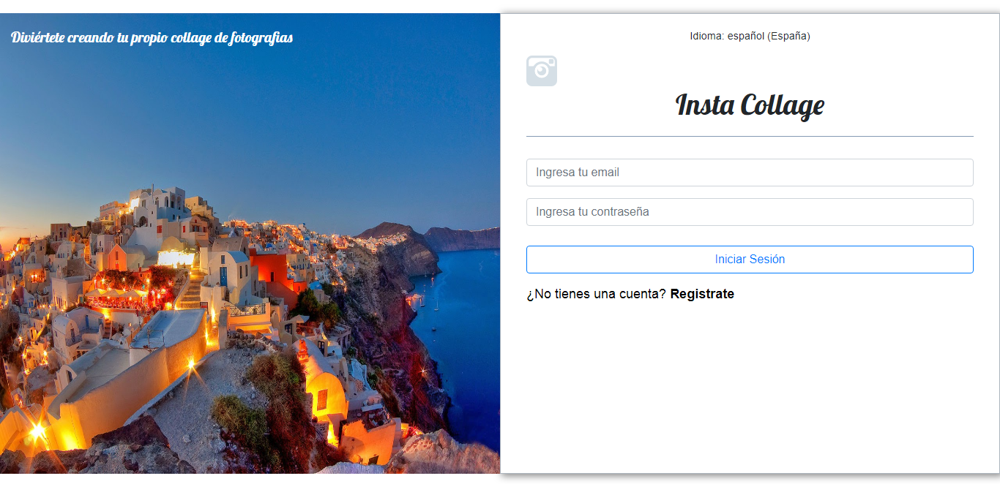
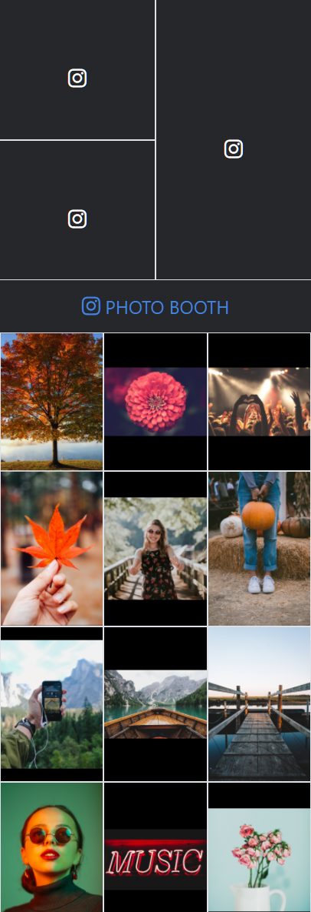

# INSTA COLLAGE

### Challenge drag and drop
#### Objetivo:
Crear una página web usando la API Drag and Drop de HTML5.
La pagina web nos permitirá hacer un collage con las imágenes de nuestro gusto.

**Vista del Formulario**

**Vista del Collage**  

#### Herramientas:
- Bootstrap 4
- CSS3
- HTML5
- api Drag And Drog
- JS ES6
- Jquery

#### Detalles del Repositorio:
- Para este producto y sus distintas vistas se utilizaron 3 archivos *html* y su archivo *JavaScript* respectivo.
- Se encuentran dos archivos *css* uno para el diseño de logueo del usuario y otro para la vista de general de Insta-college.

#### Sobre el futuro del producto:
- Se planea utilizar  la base de datos Firebase para el registro de usuarios.
- Añadir una vista donde nuestros usuarios puedan publicar sus collage. 

#### Desarrolladoras:
- Daniela Gonzales  
- Elizabeth Segura
